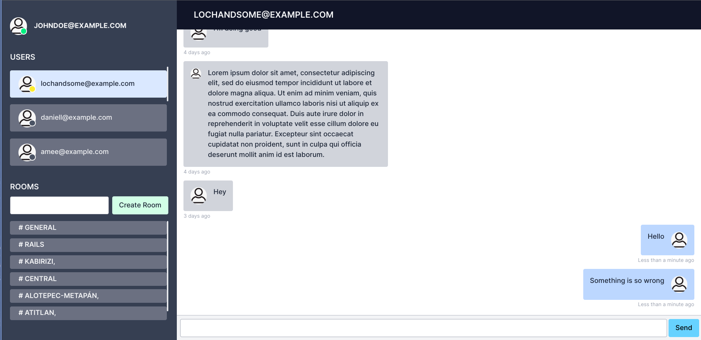

# Turbo Rails Chat

## A realtime chat messaging app built with Ruby on Rails 7

### Description

A chat messaging app built with Rails 7, Hotwire stack (Turbo and Stimulus)
and Tailwind CSS.

### Overview

- Messaging with realtime updates using Turbo Stream and Action Cable.
- Public and private chat.
- Realtime user statuses (online, offline and away).

### Screen Shots

### Installation and Setup Instructions

Make sure you have [Redis](https://redis.com/) installed and running in your machine.

You might need to install [libvips](https://github.com/libvips/libvips) for
images processing (for [Active Storage](https://guides.rubyonrails.org/active_storage_overview.html))

Clone the repository to your local machine:

- Navigate to your cloned directory.
- Run <code>bin/rails db:setup</code>.
- <code>bin/dev</code> to run the app.

### Todo

- [ ] Restyle Devise views.
- [ ] Implement message file attachments with preview.
- [ ] Implement infinite messages scroll.
- [ ] Unread chatroom notifications.
- [ ] Implement authorization.
